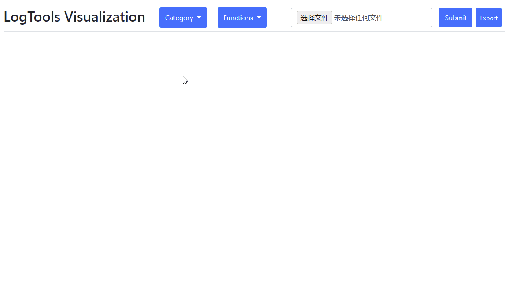

# README

## 示例

## 文档

NO.|文件名称|摘要
:--:|:--|:--
0008| [LogTools_Backend](src/0008_LogTools_Backend/README.md) | LogTools模板从data.txt中获取数据显示
0007| [LogTools_javascript](src/0007_LogTools_javascript/README.md) | LogTools模板加入JS处理逻辑
0006| [LogTools](src/0006_LogTools/README.md) | LogTools模板
0005| [Flask_Dashboard](src/0005_Flask_Dashboard/README.md) | Dashboard模板
0004| [Flask_Upload_zip](src/0004_Flask_Upload_zip/README.md) | 上传zip
0003| [Flask_Upload_file](src/0003_Flask_Upload_file/README.md) | 上传文件
0002| [Flask](src/0002_Flask/README.md) | Flask模板
0001| [Docker_Flask](src/0001_Docker_Flask/README.md) | 访问Docker容器内部的Flask
